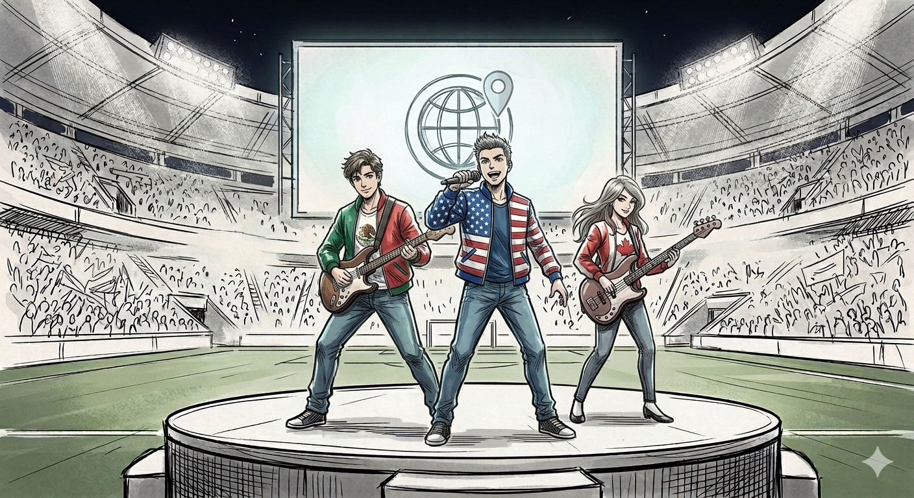

# 🎧 Catch the Cup  
*A Localization Case Study on Designing Multilingual UX Through Music*

---

## 📌 Overview

**"Catch the Cup"** is a multimedia localization case study that explores how multilingual UX can be designed through music in a global entertainment context.

Built around an original stadium-style song, the project develops a single musical concept into **three distinct versions**, each aligned with a different audience moment in a live event. Rather than treating localization as a final layer, it positions language, structure, and timing as core elements of the experience.

Created by Marllos Paiva Prado, the case study combines multilingual songwriting, Brazilian Portuguese transcreation, audiovisual subtitle timing, and content strategy. Inspired by the 2026 World Cup and the 30th Anniversary of Pokémon, it examines how localization can shape emotion, accessibility, and engagement at scale.

### 🎯 Objectives

This project was designed to explore and demonstrate:

* **Multilingual songwriting and adaptation** across English, French, and Spanish
* **Brazilian Portuguese transcreation** developed as a subtitle-layer adaptation balancing fidelity, rhythm, rhyme, and readability
* **Audiovisual execution** through precise subtitle timing, segmentation, and music-synced delivery
* **Strategic thinking in global entertainment** by aligning creative choices with audience experience and event-driven content

---

## 🌍 Localization Approach

As the 2026 World Cup is co-hosted by the USA, Canada, and Mexico, the project uses a **multilingual integration approach** in which English, French, and Spanish coexist within the same composition rather than being separated into standalone versions.

This structure reflects both the multicultural logic of the event and the dynamics of global entertainment, where multiple languages can operate within a single shared experience. A Brazilian Portuguese transcreation layer was also added in subtitles, making the adaptation process itself visible to the audience.

Each language functions as a distinct expressive voice:

* 🇺🇸 **English** — Lead voice, clear and anthemic
* 🇨🇦 **French** — Expressive and theatrical
* 🇲🇽 **Spanish** — Rhythmic and energetic

Together, these languages create contrast, momentum, and musical variation rather than serving as interchangeable translations.

---

## 🎧 Multi-Track Strategy

Rather than producing a single final version, the project was designed as a coordinated set of three variations:

* **Pre-Game** — anticipation and build-up
* **Halftime** — accessibility and crowd engagement
* **Closing** — emotional payoff and multilingual lift

All three tracks share the same trilingual lyrical core, but each version reshapes its structure to match a different musical style and audience moment. Verse placement, chorus timing, and language sequencing were adjusted to support the emotional pacing of each track.

Each track is presented as a subtitled video with the original multilingual lyrics and a Brazilian Portuguese transcreation layer designed for singability, clarity, and musical continuity.

---

### 1. Pre-Game Track — Country-Pop Hybrid

Builds anticipation through a gradual energy progression and stadium-ready tension.

**Video thumbnail placeholder:**  

---

### 2. Halftime Track — Pop-Rock Accessible

Designed for broad audience engagement, with high memorability and a strong sing-along structure.

**Video thumbnail placeholder:**  

---

### 3. Closing Track — Multilingual Anthem

Delivers an emotional payoff through multilingual layering and a more cinematic progression.

**Video thumbnail placeholder:**  

---

## ✍️ PT-BR Transcreation Notes

The Brazilian Portuguese layer was developed as a **transcreation**, not as a literal translation. Its role was to balance semantic fidelity with singability, subtitle readability, and sonic cohesion across each stanza.

In practice, this meant preserving core meanings such as unity, momentum, and celebration while allowing selected lines to shift in wording to support rhythm, rhyme, and musical continuity.

This layer highlights a central principle of the project: in music localization, meaning must often be negotiated together with form, pacing, and audience perception.

---

## 🎬 Audiovisual Localization

Subtitles were developed as part of the audiovisual experience, not just as a translation layer. The process emphasized:

* **Timing aligned with musical phrasing**, so subtitles follow rhythm as well as meaning
* **Readable line segmentation and controlled CPS**, preserving lyrical flow and accessibility
* **Strategic subtitle exposure and multilingual clarity**, giving key moments room to breathe while supporting smooth transitions across English, French, and Spanish

The visual design remains intentionally minimal, keeping subtitles as the main carrier of meaning and emotional pacing.

---

## 🧩 Skills Demonstrated

Through this project, the following skills are demonstrated:

* Multilingual songwriting adaptation and transcreation
* Subtitle timing and audiovisual synchronization
* Cross-cultural content strategy with AI-assisted prototyping

---

## ⚠️ Disclaimer

This is a non-commercial, fan-made project created for portfolio purposes only.

It is not affiliated with or endorsed by:

* The Pokémon Company International
* FIFA

All references are used purely as creative inspiration.

---

## 📬 Contact

**Marllos Paiva Prado**  
[LinkedIn](https://www.linkedin.com/in/marllos-p-a383641b2)  
[marllospaiva@gmail.com](mailto:marllospaiva@gmail.com)

---

## 💡 Final Note

This project explores how localization can evolve beyond translation — into the design of shared experiences for global audiences.
